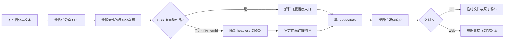

# 从分享文本到可信字节流：一个视频下载器的架构拆解

实现一个视频下载器，最容易产生的错觉是：找到页面里的播放地址，然后执行一次 HTTP GET，问题就结束了。真正落到工程实现时，下载反而是最简单的一段。困难集中在下载之前和下载之后：用户输入是一整段夹杂口令、标题和标点的分享文案；短链接会发生多次跳转；移动 SSR 可能只留下作品 ID；桌面页面依赖动态签名和风控会话；媒体网关还会继续跳转到 CDN；网页端又不能把上游地址直接交给浏览器。

因此，这个工具的核心不是“找到一个 URL”，而是建立一条连续的信任转换链：把不可信文本收敛为受限制的分享地址，把易变化的页面结构压缩为稳定的 `VideoInfo`，再把内部媒体能力转换成受控的文件或浏览器字节流。每一层只接受上一层已经验证过的状态，并在跨越网络、文件系统和浏览器边界时重新校验关键不变量。

这条思路比某个具体页面字段更重要。页面结构会变化，CDN 域名可能扩展，交互入口也可以从 CLI 演进到 Web；只要信任转换的边界仍然清晰，变化就会被限制在局部，而不会把整个下载流程重新推倒。

## 朴素下载方案缺少的不是解析技巧，而是边界

最短实现通常会用正则从分享文本中取出第一个 URL，允许 HTTP 客户端自动跟随跳转，再从 HTML 中搜索 `.mp4` 或某个 JSON 字段，最后把响应直接写到目标文件。它在理想样本上可能工作，却同时积累了四类风险。

首先，分享文案不是可信输入。如果程序只确认字符串中出现了 `douyin.com`，那么 `douyin.com.evil.example` 之类的仿冒主机也可能通过检查。更危险的是，可信短链接本身还会重定向；只验证第一个地址而放任后续跳转，等价于把 HTTP 客户端变成可访问任意目标的代理。

其次，页面不是稳定 API。桌面作品页可能依赖 JavaScript 启动或返回风控页面，服务端渲染数据中的路由键也可能随前端构建变化。如果下载层直接依赖整份页面 JSON，那么上游增加统计字段、调整路由名或插入无关数据，都可能沿调用链扩散。

再次，能够播放不等于拿到了原内容。移动分享页暴露的 `/aweme/v1/playwm/` 面向分享展示，可能烧录平台水印并附加引流尾帧。即使把请求参数写成 `2160p`，也只是在向服务器表达偏好，不能证明返回文件就是创作者上传时的母版。

最后，直接写最终文件会制造错误状态。网络中断后，用户会看到一个扩展名正确但内容残缺的 MP4；两个同名下载并发运行时，先检查再重命名还可能形成覆盖竞争。网页端若直接把媒体地址发给浏览器，又会绕过服务端建立的域名、跳转和响应类型检查。

这些问题共同指向同一个设计目标：系统不仅要完成成功路径，还要让失败停止在正确的边界上。输入错误应停在文本解析阶段，页面变化应停在解析层，异常媒体响应应停在下载边界，传输中断则不应发布成完整文件。

## 单向架构把易变页面压缩成稳定状态

整个程序围绕一个很小的内部模型组织：

```go
type VideoInfo struct {
	ID       string
	Author   string
	Title    string
	MediaURL string
}
```

`VideoInfo` 不是页面数据的镜像，而是页面解析层与下载层之间的稳定契约。解析层负责理解分享页，并且只有在作品 ID、媒体地址和地址信任校验全部成立后才构造它；下载层不需要知道 `_ROUTER_DATA`、路由键或水印入口，只消费这个已经收敛的结果。

主链路可以概括为以下状态转换：



这不是为了追求层数，而是在隔离真实变化点。`share.go` 只处理用户输入和分享域名；`resolver.go` 处理页面请求、SSR 状态和策略调度；`browser_detail.go` 只负责浏览器详情捕获与清晰度选择；`downloader.go` 只处理媒体响应、文件名与文件发布；`web_server.go` 在同一核心链路外增加浏览器协议；`tickets.go` 则只管理短期授权状态。CLI 和 Web 的入口不同，但都复用同一个 resolver 与 downloader，因此不会出现网页能下载、命令行却采用另一套地址判断的分叉。

程序入口也刻意保持轻薄。`main.go` 负责参数、信号、标准输出和退出码；收到 `Ctrl+C` 后取消根 `context.Context`，页面请求、媒体请求和服务关闭都沿同一取消信号收敛。业务错误由各阶段包装后返回，入口只负责向用户说明失败发生在哪一段。

模块边界还带来一个测试上的直接收益。`webApplication` 依赖的是 `videoResolver` 和 `mediaOpener` 两个窄接口，测试可以用本地假对象替换外部网络，却仍然覆盖真实的 HTTP 路由、票据状态和响应头。这种接口不是为“抽象”而抽象，它服务的是唯一明确的变化点：外部依赖必须能够从进程内测试中移除。

## 解析链路的本质是逐级缩小信任范围

分享文本的提取分成两个动作。正则表达式只负责从自然语言中找到 URL 候选，不承担安全判断；候选随后交给 `net/url` 解析，并要求使用 HTTPS、不能包含用户信息、主机必须等于允许域名或以 `.` 加允许域名结尾。于是 `v.douyin.com` 和 `www.iesdouyin.com` 可以通过，而 `douyin.com.evil.example` 会被拒绝。

同样的判断还会应用到重定向。HTTP 客户端最多允许十次跳转，每一次都重新执行地址策略。这一点保护的是一条重要不变量：一个最初可信的短链接，不能把程序带到不可信或本地网络目标。页面地址和媒体地址使用不同白名单，因为它们承担不同职责，但共享相同的 `newRestrictedHTTPClient` 与跳转策略。

获得可信分享 URL 后，resolver 先使用固定移动端 User-Agent 请求页面。这个动作成本低，旧页面还能直接返回完整作品状态。页面请求有 30 秒总超时，等待响应头最多 20 秒，正文最多读取 4 MiB。多读一个字节再判断是否越界，使“刚好达到上限”和“实际超过上限”可以被区分；异常上游不能无限占用内存。

页面解析围绕 `window._ROUTER_DATA` 展开，但没有用正则表达式解析嵌套 JSON。代码只用字节搜索定位赋值起点和 `</script>` 终点，然后把中间内容交给 `encoding/json`。这样，标题中的转义字符、嵌套对象和数组不会破坏解析。外层只声明 `loaderData`，内部条目先保留为 `json.RawMessage`；程序遍历所有 loader 条目，寻找包含 `videoInfoRes.item_list` 的节点，而不是绑定当前可能变化的 `video_(id)/page` 键名。

这种“宽松寻找、严格产出”的策略很关键。无关 loader 条目无法解码成视频结构时会被忽略；一旦识别出视频条目，作品 ID 和播放地址就必须存在，否则立即返回明确错误。解析层只保留作者、标题、ID 和媒体地址，页面里的推荐、评论、统计等字段不会进入系统核心。

2026 年 8 月的实际页面暴露了更深一层变化：`video_(id)/page` 仍存在，但只留下十进制 `itemId`，原来的 `videoInfoRes.item_list` 已消失。这不是 JSON 解析失败，而是 SSR 输出契约发生变化。resolver 因此把“完整视频”和“只有 itemId”建模成两个合法解析结果：前者继续走轻量路径，后者通过窄接口委托给浏览器详情解析器。旧能力没有被删除，新变化也没有被塞进下载层。

浏览器后备没有在 Go 中复制 `a_bogus` 算法。实际验证表明，孤立的 X-Bogus 或 a_bogus 即使能生成字符串，也可能因为缺少当前浏览器会话令牌而得到 `HTTP 200 + 空正文`。维护一份静态签名代码会把程序绑定到另一个更不稳定的隐式契约。当前实现让本机 Chrome、Chromium 或 Edge 执行官方页面脚本，只监听主机严格等于 `www.douyin.com`、路径严格等于作品详情接口、`aweme_id` 严格等于预期作品的响应。响应加载完成后才读取正文，随后立即关闭隔离浏览器。

浏览器详情中的媒体选择也不是简单取数组第一个元素。程序排除 `download_addr` 和 H.265 候选，只在 `video.bit_rate`、`play_addr_h264` 与 `play_addr` 中寻找受信任媒体域名，并按像素总数、码率、文件大小依次排序。这样，“原片”在本工具中的可执行定义变成：官方公开详情提供的、无品牌下载入口、最高可用 H.264 内容流。它仍不等价于创作者上传母版，但比盲目改写一个分享网关参数更贴近实际公开最高规格。

媒体地址还要经历一次语义转换。分享页的 `video.play_addr.url_list[0]` 通常指向 `/aweme/v1/playwm/`。代码不会做全局字符串替换，而是先解析 URL，确认主机属于媒体白名单、路径只能是 `/playwm/` 或 `/play/`、查询参数中必须存在 `video_id`，随后才将路径改为 `/aweme/v1/play/`，删除 `logo_name` 并把 `ratio` 设置为 `2160p`：

```go
query := mediaURL.Query()
if query.Get("video_id") == "" {
	return nil, errors.New("作品播放地址缺少 video_id")
}
mediaURL.Path = "/aweme/v1/play/"
query.Del("logo_name")
query.Set("ratio", preferredOriginalRatio)
mediaURL.RawQuery = query.Encode()
```

这里必须区分“原内容流”和“上传母版”。旧路径中的 `/play/` 去掉的是分享展示层的水印与尾帧，`2160p` 表达的是期望规格，媒体服务器仍可能向下协商；新路径则从官方详情给出的 H.264 转码中选择最高项。问题链接的实际结果是 H.264、1920×1080、5.533 秒。由此能证明的是公开页面当时提供的最高可用原内容版本，而不是逐字节一致的创作者上传文件。

## 下载阶段要保护“完整交付”，而不只是传输字节

resolver 产出的 `MediaURL` 在真正请求前还会被 downloader 再验证一次。这个重复不是浪费：`VideoInfo` 可能来自测试替身，未来也可能来自缓存或其他 resolver。把验证放在出站请求的最后边界，可以保证任何调用方都无法绕过媒体域名策略。媒体网关跳转到 CDN 时，每一跳仍会重新校验。

视频请求不设置覆盖整个正文传输的固定超时，因为视频体积和用户带宽差异很大；等待响应头仍受 20 秒限制，正文则由调用方的 context 控制取消。响应必须是 2xx，并且 `Content-Type` 只能是视频、`application/octet-stream` 或空值。允许空类型是对部分 CDN 行为的兼容，拒绝 HTML 和 JSON 则避免把风控页或 API 错误保存成 MP4。

CLI 交付的是文件，因此它需要解决“何时算下载成功”。程序在目标目录创建隐藏的 `.part` 文件，通过 256 KiB 固定缓冲区执行 `io.CopyBuffer`，内存占用不会随视频大小线性增长。只有复制完成、文件成功关闭并设置权限后，临时文件才有资格发布；任意错误都会触发清理。

最终文件没有使用“检查是否存在，然后重命名”的常见写法，因为两个并发任务可能同时通过检查。当前实现通过同目录硬链接发布：`os.Link` 在目标已存在时直接失败，不会覆盖旧文件；程序再尝试带数字后缀的名称。成功建立最终链接后才删除临时名称。这个选择把“不覆盖”交给文件系统原子操作保证，但也有明确边界：保存目录必须支持硬链接，跨文件系统或某些特殊挂载不在当前实现的兼容范围内。

网页端交付的是 HTTP 字节流，不能复用 CLI 的落盘发布过程，否则服务端会额外占用磁盘并增加首字节等待。浏览器先提交：

```http
POST /api/resolve
Content-Type: application/json

{"shareText":"https://v.douyin.com/example/"}
```

服务端完成完整解析后，把 `VideoInfo` 保存到内存票据表，返回作者、标题、文件名和本地下载地址。票据由 24 个密码学随机字节编码而成，有效期十分钟；它只引用服务端状态，不携带上游媒体地址。浏览器随后访问 `GET /api/download/{ticket}`，服务端重新通过 `OpenMedia` 打开受信任媒体响应，设置 `Content-Disposition: attachment`，再用固定缓冲区把正文直接转发给浏览器。

票据在到期前可以重复使用，这是对瞬时网络失败和浏览器重试的刻意容忍。过期清理由签发和读取操作顺便完成，不启动后台 goroutine；对于单用户本地工具，这比引入独立清理生命周期更容易推理。代价也很清楚：它不是持久任务系统，进程重启会使全部票据失效，也没有跨实例共享状态。

## 安全机制围绕出站网络与本地浏览器两条边界展开

下载器最需要防守的不是复杂密码学，而是 SSRF 和隐式信任扩散。分享地址、页面重定向、媒体入口和 CDN 重定向都来自外部数据，因此程序在每一个真正发起请求的位置验证 HTTPS 与域名后缀。后缀判断要求完整主机或点分隔子域名，不能用模糊的字符串包含关系。白名单需要维护，但这种维护成本比“接受任意播放地址”更可控，也更容易审查。

资源上限是另一种边界。分享页最多 4 MiB，网页解析请求体最多 16 KiB，跳转最多十次，响应头等待最多 20 秒，浏览器后备最多运行 35 秒。这些限制并不试图判断内容是否正常，而是保证异常响应无法无限占用本地内存、连接或控制流。浏览器解析还用容量为一的信号槽串行化，避免多个网页请求同时拉起大量 Chrome 进程。媒体正文不能预设很小的大小上限，因此采用流式复制和 context 取消，把资源消耗约束为固定缓冲区与一个活动连接。

本地网页服务默认只监听 `127.0.0.1`，但“只在本机”不等于天然安全。恶意网站仍可能尝试让浏览器访问本机端口。解析接口因此要求 `application/json`，并校验浏览器 `Origin` 必须与当前 Host 一致；命令行 HTTP 客户端没有 Origin 时仍可调用。页面使用仅允许 `'self'` 的内容安全策略，不加载第三方脚本、字体、统计或图片，同时设置 `frame-ancestors 'none'`、`X-Frame-Options: DENY`、`nosniff` 与 `no-referrer`。

下载接口使用不可猜测的短期票据，而不是接受一个任意 `url` 参数。这一设计同时完成了三件事：浏览器看不到上游网关，下载动作只能引用已经解析成功的 `VideoInfo`，服务端还会在实际出站前再次执行媒体安全策略。它本质上是把一个强能力，也就是“让本机服务访问某个媒体地址”，缩小为一个有时效、有来源约束的局部能力。

当前实现仍有一个可观测性边界。Web 响应头发送后，如果 `io.CopyBuffer` 中途失败，服务端已经无法再返回结构化 JSON 错误；浏览器通常会依据连接中断或 `Content-Length` 不匹配判断下载不完整，但服务端目前没有记录这类传输失败。若工具演进为长期运行的多人服务，至少应补充结构化日志、活动下载数、失败阶段和传输字节指标，并考虑速率限制与更严格的访问认证。

## 测试冻结内部契约，真实 QA 观察外部漂移

如果所有测试都依赖真实页面，它们会同时受到网络、风控、作品权限和页面发布节奏影响，失败时很难判断是代码回归还是外部变化。当前测试因此把两类证据分开：自动化测试冻结程序能够控制的契约，人工 QA 观察程序无法控制的现场行为。

自动化测试使用 `httptest.Server` 和窄接口替身，覆盖分享文本、仿冒域名、短链重定向、移动端请求头、旧 SSR 数据解析、新 SSR `itemId` 调度、浏览器详情作品绑定、最高 H.264 选择、媒体类型、临时文件、同名发布、Web 同源检查、票据过期和浏览器附件响应。完整 Web 测试还会确认解析响应没有泄漏 `MediaURL`，再使用返回的票据下载假视频正文，从而贯穿“解析、授权、下载”整个本地协议。

测试刻意不把真实页面快照当作长期真理。`_ROUTER_DATA` 的最小样本用于验证字段映射和容错策略，真实分享链接则在发布前单独运行。这样，当线上 QA 失败而单元测试仍通过时，排查方向会首先落到页面形态、风控或 CDN 域名漂移；当本地契约测试失败时，才说明代码自身破坏了既定不变量。

网页还经过真实浏览器验证，包括桌面布局、390×844 移动视口、深色模式、解析失败状态、真实作品解析和附件下载。示例文件使用媒体探测工具确认编码、分辨率与时长，浏览器控制台保持零错误、零警告。这里的 QA 证明的是当次端到端链路可用，并不替代持续测试，因为页面与 CDN 策略仍然是外部依赖。

这套验证结构给出了一个可迁移的判断：稳定测试应该锁定自己的状态转换和安全边界，不应该假装能够冻结外部网站；外部行为则需要少量、明确、可重复的现场检查来补齐。两者缺一不可，但失败语义必须分开。

## 当前方案故意停在公开分享链路之内

这个工具没有实现登录 Cookie、验证码绕过、上传母版获取、批量账号抓取或面向用户的多清晰度枚举。浏览器后备只复用公开页面自行建立的匿名会话，不读取用户浏览器配置，也不处理验证码。上述能力并非简单增加几个参数，而是会改变系统边界：登录态引入凭证存储和权限风险，验证码绕过带来稳定性与合规问题，批量下载需要限速、任务状态和失败恢复，多清晰度则需要证明每个候选地址的语义与有效期。

如果继续演进，合理顺序不是先增加更多解析技巧，而是沿现有边界扩展能力。下载进度可以在流式复制处增加计数字节；断点续传需要让 `OpenMedia` 支持并验证 Range 语义，并重新设计临时文件恢复；多解析器可以实现同一个 `videoResolver` 接口；多人部署则必须替换进程内票据、增加认证、配额、审计和完整可观测性。每一步都应明确自己改变了哪条不变量，而不是把新分支塞进当前主流程。

最终，这次 SSR 漂移反而验证了最初的架构判断：真正值得复用的不是某个字段或签名算法，而是把解析策略收敛到同一个窄模型。在不稳定输入旁建立边界，用最小内部模型隔离页面变化，在每个出站点重新验证信任，把大对象保持为流，并让失败停在不会伪装成成功的位置。具体字段仍会过期，但新增浏览器策略没有迫使 CLI、Web 或下载阶段改写，这正是边界产生的工程价值。
